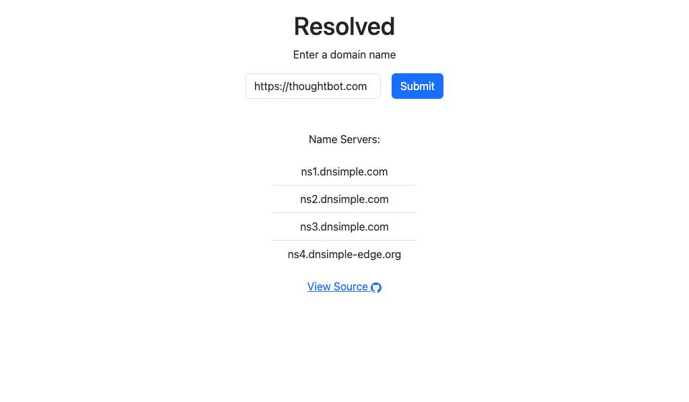

# Resolved 🌐

Learn how to build (and test) a [production ready][1] Rack application from
scratch.



## Topics Covered 📚

Each [commit][2] serves as a mini lesson.

- Rendering dynamic content with `ERB`.
- Using HTTP compression and caching to drastically improve application
  performance.
- Error handling.
- Building a simple logging mechanism.
- HTTP security best practices.
- Configuring a test suite and GitHub Actions.

## Setup 🚀

```
bundle install
```

## Local Development 🧱

```
bin/dev
```

## CI ✅

```
bundle exec rake
```

## Contributing

See the [CONTRIBUTING] document.
Thank you, [contributors]!

  [CONTRIBUTING]: CONTRIBUTING.md
  [contributors]: https://github.com/thoughtbot/resolved/graphs/contributors

## License

Resolved is Copyright (c) thoughtbot, inc.
It is free software, and may be redistributed
under the terms specified in the [LICENSE] file.

  [LICENSE]: LICENSE

<!-- START /templates/footer.md -->
<!-- END /templates/footer.md -->

[1]: https://resolved-9623c76e6dbd.herokuapp.com
[2]: https://github.com/thoughtbot/resolved/commits/main
